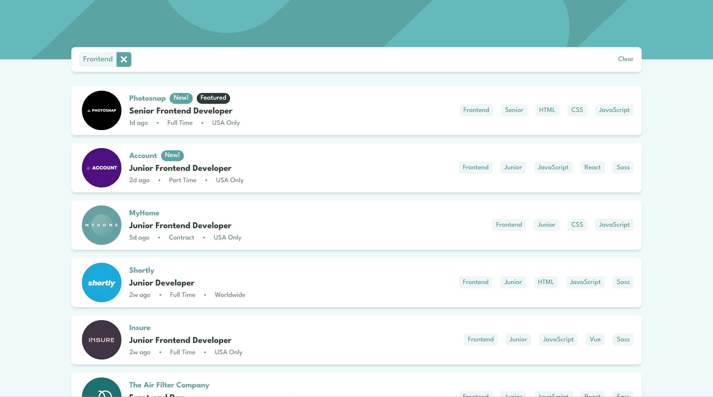
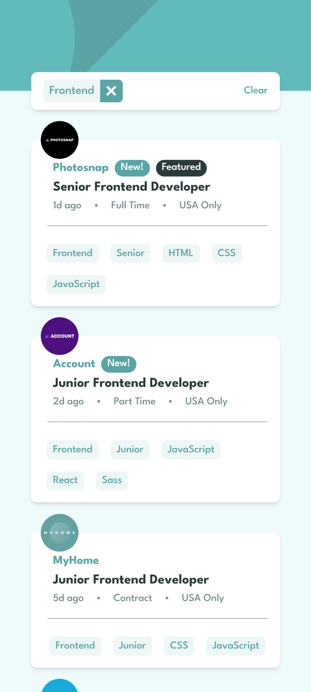

# Frontend Mentor - Job listings with filtering

## Table of contents

- [Overview](#overview)
  - [The challenge](#the-challenge)
  - [Screenshot](#screenshot)
  - [Links](#links)
- [My process](#my-process)
  - [Built with](#built-with)
  - [What I learned](#what-i-learned)
  - [Useful resources](#useful-resources)
- [Author](#author)

### Screenshot

Desktop Preview

### Mobile Preview

### Links

- Solution URL: [Frontend Mentor Solution](https://www.frontendmentor.io/solutions/job-listings-with-filtering-i9iG2ozyUx)
- Live Site URL: [Live Site at Netlify](https://static-jobs-listing-ola.netlify.app/)
## My process

### Built with

- React Js
- vitejs 
- tailwind-css
- Flexbox
- Responsive Design
- TypeScript
- Media queries

### What I learned

To build app faster

### Useful resources

## Author

- Github - [olamilekan21](https://github.com/olamilekan21/)
- Frontend Mentor - [@olamilekan21](https://www.frontendmentor.io/profile/olamilekan21)
